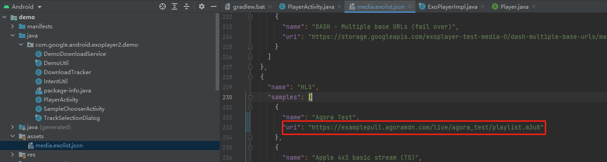
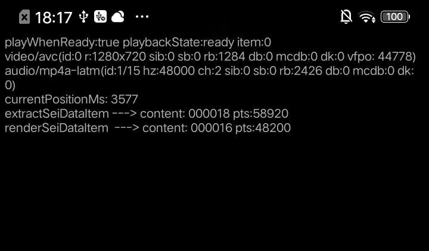
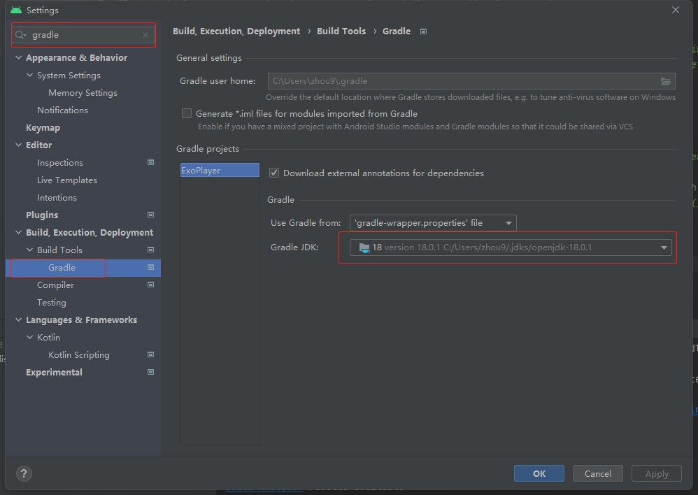
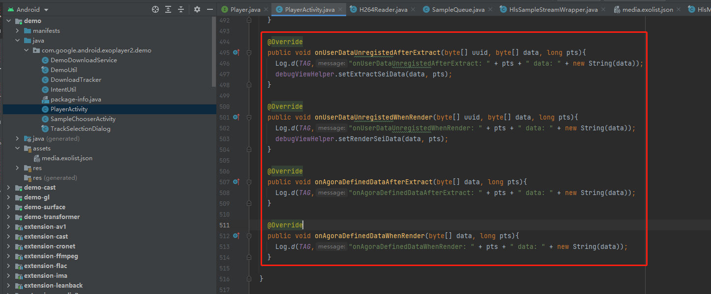

# Instructions of sei callback inferface


Based on Google's official ExoPlayer project, we added a callback interface for sei data retrieval. Currently, only user data unregisted data can be returned, and this callback interface is valid only when processing HLS streams.

**project location:**

>github： https://github.com/AgoraLab/ExoPlayer.git
>branch：release-v2 

## Launch demo

Before launch the demo to testing, you can modify this uri field to your stream source address.




After demo launched, you will see the "extractSeiDataItem" or "renderSeiDataItem" contents if user-data-unregisted data has been extracted. As is shown below.



## Use case 

In order to get the user-data-unregisted data, you can implement the interface of 'Player.Listener', and registe to player object.

Just like PlayerEventListener class that is implemented in the PlayerActivity.java file.

```java
player =
    new ExoPlayer.Builder(/* context= */ this)
        .setRenderersFactory(renderersFactory)
        .setMediaSourceFactory(createMediaSourceFactory())
        .setTrackSelector(trackSelector)
        .build();
player.addListener(new PlayerEventListener());
```



In the PlayerEventListener class, this two interface above retrun the user-data-unregisted data.

## Description of interface

```java
// com.google.android.exoplayer2.player

public interface Player {

    interface Listener {

        /**
        * Called when user-data-unregisted of sei extract form stream. current only valid for hls
        * @param uuid   uuid in the user-data-unregisted content
        * @param data   payload data in the user-data-unregisted content
        * @param pts    presentation time stamp extract from pes header of hls 
        */
        default void onUserDataUnregistedAfterExtract(
            byte[] uuid, 
            byte[] data,
            long pts){}

        /**
        * Called when render time is equal to pts of user-data-unregisted. current only valid for hls
        * @param uuid   uuid in the user-data-unregisted content
        * @param data   payload data in the user-data-unregisted content
        * @param pts    presentation time stamp extract from pes header of hls 
        */
        default void onUserDataUnregistedWhenRender(
            byte[] uuid, 
            byte[] data, 
            long pts){}
    }
}
```


## Issue of demo compiling 

If you get the following error message when compile the demo, please modify the jdk version of gradle.

android studio compile error:
```sh
Algorithm HmacPBESHA256 not available
```

settion option:

you need to choose 16/18 version as option



